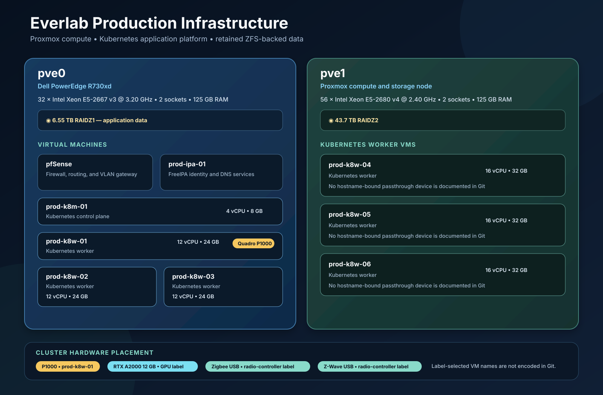
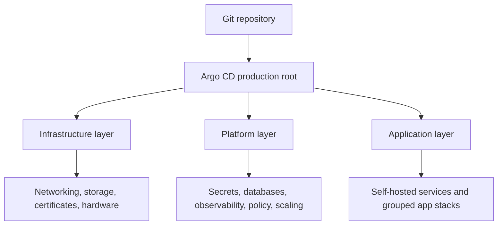

# Everlab GitOps

[](https://github.com/sudo-su-556x45/everlab_GitOps_Public/actions/workflows/validate.yml)

Declarative configuration for the Everlab production environment. Ansible prepares the lab's Debian Kubernetes VMs, while Argo CD continuously reconciles the cluster through an app-of-apps hierarchy with Kustomize for local resources and pinned Helm releases for third-party controllers.

The cluster consists of one control-plane node and six worker nodes. Workloads span infrastructure services, observability, secrets management, databases, home automation, media, AI, and developer tooling.

> [!NOTE]
> This is a sanitized, history-free portfolio snapshot of the Everlab design.
> It contains no credentials and is not the repository reconciled by the live
> production cluster.

## Architecture



The physical lab is split across two Proxmox hosts:

| Host | Compute | Memory | Storage | Guests |
| --- | --- | --- | --- | --- |
| `pve0` (Dell PowerEdge R730xd) | 32 × Intel Xeon E5-2667 v3 at 3.20 GHz, 2 sockets | 125 GB | 6.55 TB RAIDZ1 application data | pfSense, `prod-ipa-01`, `prod-k8m-01`, `prod-k8w-01`–`03` |
| `pve1` | 56 × Intel Xeon E5-2680 v4 at 2.40 GHz, 2 sockets | 125 GB | 43.7 TB RAIDZ2 | `prod-k8w-04`–`06` |

`prod-k8m-01` has 4 vCPU and 8 GB RAM. Workers on `pve0` have 12 vCPU and 24 GB RAM each; workers on `pve1` have 16 vCPU and 32 GB RAM each. The repository explicitly pins the Quadro P1000 to `prod-k8w-01`. RTX A2000 and Zigbee/Z-Wave USB workloads select nodes through Kubernetes hardware labels, but their VM hostnames are not encoded in Git.

The GitOps delivery hierarchy is:



The bootstrap application registers three independently reconciled layers:

- `infrastructure` provides the cluster-level controllers and hardware integration required by workloads.
- `platform` provides shared operational services consumed across namespaces.
- `applications` contains standalone workloads and nested application groups for AI, media, bridges, and other multi-component systems.

Every deployable Argo CD Application is registered exactly once in this graph. Automated synchronization and self-healing keep the live cluster aligned with Git.

## Engineering Highlights

- Argo CD app-of-apps architecture with automated sync, self-healing, sync waves, and application-specific pruning controls.
- Kustomize-managed Kubernetes resources combined with multi-source, version-pinned Helm deployments.
- Cilium networking with Gateway API, load-balancer IP allocation, L2 announcements, and internal and public HTTPS listeners.
- Automated DNS and certificate lifecycle management through external-dns, cert-manager, and trust-manager.
- Centralized secret delivery from OpenBao through External Secrets Operator; secret values are not stored in Git.
- Shared NFS and node-local OpenEBS storage with retained volumes and explicit Argo CD deletion protection for persistent resources.
- CloudNativePG-managed PostgreSQL clusters with application-specific databases and storage placement.
- NVIDIA GPU Operator integration with time-sliced RTX A2000 and Quadro P1000 resources for AI, photo processing, and media transcoding.
- Hardware-aware scheduling for Zigbee and Z-Wave USB devices through a Kubernetes device plugin.
- Multus secondary networks for workloads requiring direct LAN or dedicated VLAN connectivity.
- Full monitoring and logging stack with Prometheus, Grafana, Loki, Alloy, Blackbox Exporter, InfluxDB, and Telegraf.
- Policy, resource optimization, and event-driven scaling through Kyverno, Goldilocks, Descheduler, KEDA, and the KEDA HTTP add-on.

## Cluster Platform

| Area | Components | Purpose |
| --- | --- | --- |
| GitOps | Argo CD, Kustomize, Helm | Declarative delivery, drift correction, and layered application ownership |
| Networking | Cilium, Gateway API, Multus, Cloudflare Tunnel | Pod networking, service exposure, secondary interfaces, and selected external access |
| DNS and TLS | external-dns, cert-manager, trust-manager | Automated DNS records, certificates, and trust distribution |
| Secrets | OpenBao, External Secrets Operator | Central secret storage and namespace-scoped Kubernetes Secret generation |
| Databases | CloudNativePG, MongoDB, Valkey, SQLite | Managed and workload-specific stateful services |
| Shared storage | NFS CSI | Retained persistent storage and shared `ReadWriteMany` data |
| Local storage | OpenEBS LocalPV | Node-affine storage for database and transcode performance requirements |
| Hardware | NVIDIA GPU Operator, generic device plugin | GPU time-slicing and controlled USB device allocation |
| Observability | Prometheus, Grafana, Loki, Alloy, Blackbox Exporter, InfluxDB, Telegraf | Metrics, dashboards, logs, endpoint probing, and time-series ingestion |
| Operations | Headlamp, Goldilocks, Metrics Server, Reloader, Descheduler | Cluster visibility, resource recommendations, configuration reloads, and workload placement |
| Policy and scaling | Kyverno, KEDA, KEDA HTTP add-on | Admission policy and event-driven workload scaling |
| Messaging | Mosquitto | Shared MQTT transport for home automation and integration services |

## Hardware-Aware Workloads

The worker pool is intentionally heterogeneous. Manifests use scheduling constraints only where a workload has a physical or locality requirement.

| Capability | Placement and use |
| --- | --- |
| NVIDIA Quadro P1000 | Time-sliced between Plex, Immich background processing, and ErsatzTV NVENC/NVDEC transcoding |
| NVIDIA RTX A2000 12 GB | Time-sliced for Ollama inference and Immich machine learning |
| Zigbee coordinator | Exposed as `everlab.dev/zigbee` on labeled radio-controller nodes |
| Z-Wave controller | Exposed as `everlab.dev/zwave` on labeled radio-controller nodes |
| Dedicated networks | Multus attachments provide direct LAN or VLAN access for selected media workloads |
| Local disks | Topology-aware OpenEBS StorageClasses bind performance-sensitive data to eligible nodes |

General applications remain portable across standard worker nodes.

## Application Portfolio

| Category | Applications |
| --- | --- |
| AI and voice | Ollama, Open WebUI, Faster Whisper, Piper |
| Photos and documents | Immich, Paperless-ngx |
| Media streaming | Plex, ErsatzTV, Music Assistant, HyperHDR |
| Home automation and video | Home Assistant, Frigate, ESPHome |
| Radio and IoT bridges | Zigbee2MQTT, Z-Wave JS UI, Ring MQTT, SolarEdge2MQTT, Xcel Itron2MQTT |
| Development and automation | Forgejo, Code Server, n8n, NocoDB |
| Productivity | Vikunja, Wiki.js, Actual Budget, Radicale, Trek |
| Communication and notifications | Matrix Synapse, Element, ntfy |
| Network and cluster interfaces | UniFi Network Application, Homepage, Headlamp |

Several application groups own supporting database Applications. PostgreSQL clusters for Forgejo, Immich, Matrix, NocoDB, Paperless-ngx, Vikunja, and Wiki.js are managed independently through CloudNativePG rather than embedded database Deployments.

## Repository Layout

```text
ansible/                  Debian and Kubernetes node bootstrap automation
├── inventories/prod/    Current Everlab VM topology and lab configuration
├── playbooks/           Bootstrap, cluster initialization, and join workflows
└── roles/               Reusable host and Kubernetes configuration
docs/                     Repository diagrams and supporting documentation
kubernetes/
├── bootstrap/prod/       Production root and layer Applications
├── infrastructure/       Networking, storage, certificates, and hardware
├── platform/             Shared controllers and operational services
└── applications/         User-facing workloads and grouped app-of-apps
```

Local-manifest applications generally keep their Argo CD registration and Kubernetes resources together:

```text
application/
├── application.yaml      Argo CD Application registration
├── kustomization.yaml    Rendered resource entry point
├── namespace.yaml        Namespace ownership when applicable
├── deployment.yaml       Workload definition
├── service.yaml          Cluster service
├── httproute.yaml        Gateway API exposure
├── externalsecret.yaml   Secret mapping without secret values
└── pvc.yaml              Protected persistent storage when required
```

Complex services preserve separate parent and database Applications instead of flattening ownership boundaries.

## Ansible Host Management

The `ansible/` tree is intentionally scoped to the current Everlab production lab: one control-plane VM and six worker VMs across `pve0` and `pve1`. The inventory records management and Kubernetes-network addresses, Proxmox placement, and VM CPU/RAM allocations. Roles configure Debian prerequisites, FreeIPA enrollment, Kubernetes packages, containerd, kubeadm, and kube-vip.

Vault data is local-only. Create and edit `ansible/inventories/prod/group_vars/all/vault.yml` with `ansible-vault`; the file and local vault-password files are ignored by Git.

Run Ansible from its repository directory:

```bash
cd ansible
ansible-galaxy collection install -r requirements.yml
ansible-inventory --graph
ansible-playbook --syntax-check playbooks/k8s-common.yml
ansible-playbook playbooks/k8s-common.yml --list-hosts
```

Operational playbooks prompt for a target. Use `--check --diff --limit <host-or-group>` where supported before applying changes, especially for connectivity-sensitive network work.

The worker network bootstrap playbook renders the lab's VLAN configuration to
`/etc/network/interfaces`. Each worker receives management VLAN 10, Kubernetes
VLAN 11, load-balancer VLAN 12, storage VLAN 20, and persistent-volume VLAN 21
using the last octet from its inventory address. VLAN 12 also installs the
return route to `192.168.0.0/24` through `192.168.12.1`. The playbook refuses
targets outside the current `k8s_workers` inventory group.

## Continuous Integration and Delivery

GitHub Actions validates every pull request and every push to `main`. The
workflow builds all Kustomizations, validates Kubernetes schemas and Everlab
storage safety rules, checks the Argo CD application graph, lints Ansible,
renders every worker network configuration, scans for secrets, and validates
the workflow itself.

CI has read-only repository permissions and no access to the Kubernetes
cluster. In this public snapshot it performs portfolio validation only; merging
here does not deploy to Everlab. The private operational repository remains the
only source reconciled by the live Argo CD installation.

Renovate configuration is included for scheduled Helm chart and container
update pull requests. Infrastructure, platform, stateful, and major-version
updates always require manual review.

See the [CI/CD guide](docs/CI-CD.md) for local validation, pull-request checks,
the production delivery model represented by the manifests, and the separate
sanitized publication process.

The private repository also contains a deterministic public-snapshot publisher.
It exports tracked files only, applies the reviewed exclusion policy, performs
a cached secret scan, creates a history-free root commit, publishes with an
exact lease guard, and waits for the public GitHub validation workflow.

## Reference GitOps Delivery Model

The operational repository uses this flow; the public snapshot is not attached
to the production Argo CD instance.

1. A configuration change is committed to the `main` branch.
2. The `everlab-prod` root Application discovers changes in the infrastructure, platform, or application layer.
3. Argo CD renders Kustomize resources and pinned Helm sources, then reconciles them into the cluster.
4. External Secrets retrieves required credentials from OpenBao.
5. Argo CD self-healing corrects drift, while resource-specific annotations protect persistent data from unintended pruning or deletion.

The external bootstrap entry point is:

```bash
kubectl apply -f kubernetes/bootstrap/prod/root-application.yaml
```

This assumes Argo CD is available in the cluster and has repository credentials configured.

## Storage and Data Safety

Persistent workloads are designed to survive application removal, node replacement, and GitOps reconciliation:

- Shared NFS StorageClasses use `reclaimPolicy: Retain`.
- Git-managed PVCs use `argocd.argoproj.io/sync-options: Prune=false,Delete=false`.
- CloudNativePG Cluster resources are prune-protected and use retained storage.
- Static NFS bindings are preserved for workloads with dedicated exports.
- LocalPV workloads explicitly account for node affinity and rescheduling constraints.
- PVCs and database clusters are never recreated as a routine configuration fix.

## Validation

Manifest changes are validated at the affected leaf and parent layers before deployment:

```bash
kubectl kustomize kubernetes/infrastructure
kubectl kustomize kubernetes/platform
kubectl kustomize kubernetes/applications
git diff --check
```

Ansible changes are checked separately from `ansible/`:

```bash
yamllint .
ansible-lint
for playbook in playbooks/*.yml playbooks/network/*.yaml; do
  ansible-playbook --syntax-check "$playbook"
done
```

Server-side dry runs and rendered-diff review are used for changes that depend on live custom resources or admission behavior.

## License

This project is licensed under the [MIT License](LICENSE).
